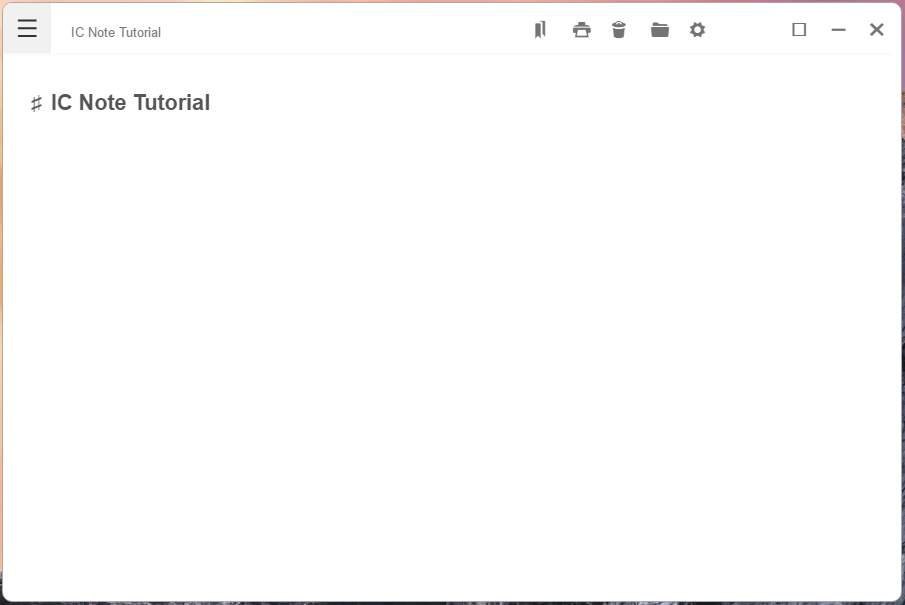

# ICNOTE (in process)

A simple note taker using electron

## The goals

* **EASY** Provide an easy way to keep little notes
* **SIMPLE** A simple but beautiful and clean design. Focus on your content ... and let it flow
* **DURABLE** Your notes are saved in your machine as a json file

> This will be like notepad but more chulo 
## Features

* Markdown support
* Realtime Preview(on enter press)
* Autosave
* Code highlight
* Programmer focused
* Tags
* And more...

TODO:
- export to markdown
- export to html
- table of content
- Drag and drop images to the editor

## Technologies

* HTML/CSS/ JavaScript
* Electron
* Nodejs

* Icons from photonkit
## License

Copyright (c) Insane Code. All rights reserved.

Licensed under the MIT License.
