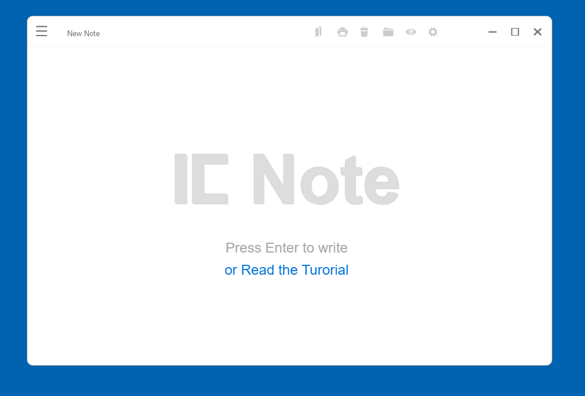
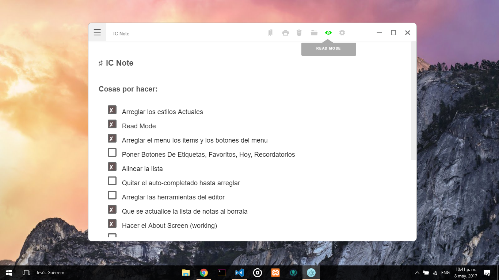
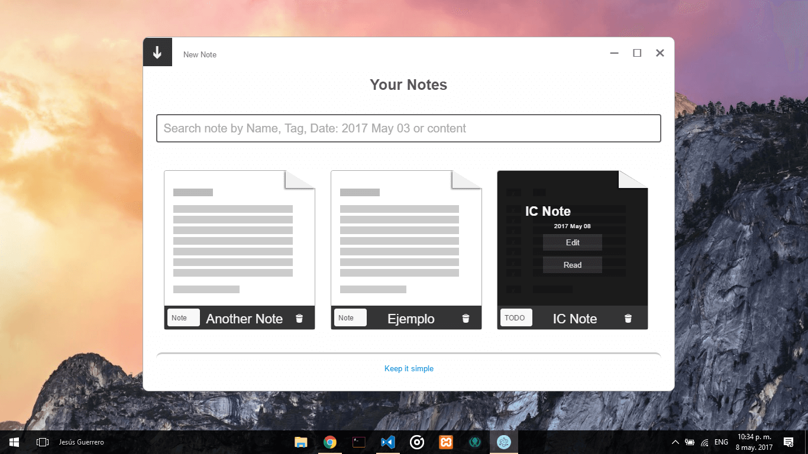
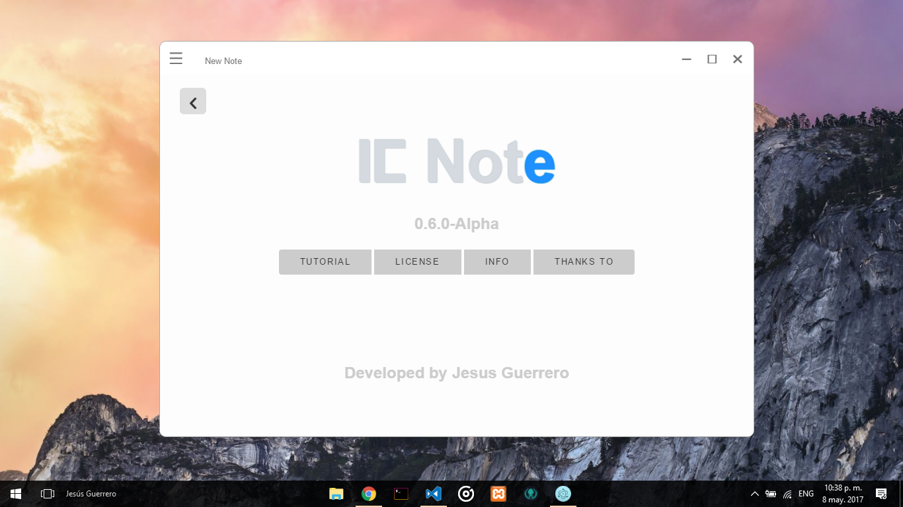

# ICNOTE (in process)

A simple note taker for programers using electron.
> I know that you'd like to use the mouse when it's    necessary,so let's save some time

## The goals

* **EASY and Fast** Provide an easy way to keep little notes
* **SIMPLE** A simple but beautiful and clean design. Focus on your content ... and let it flow
* **DURABLE** Your notes are saved in your machine as a json file

> This will be like notepad but more chulo
 
## Features

* Markdown support
* Line per Line Real Time convertion
* Autosave
* Programmer focused
* TODO list with real checkboxes
* Tags
* And more...

> You'll use real checkboxes not images

TODO:
- Table of content
- Drag and drop images to the editor
- floating note
- Reminder and send to the tray

## Technologies

* HTML/CSS/ JavaScript
* Electron
* Nodejs
* Icons from photonkit
* And some helpfull [npm modules]()

## Captures

## License

Copyright (c) Insane Code. All rights reserved.

Licensed under the MIT License.
